# Análise de dados Petlove - Investigação sobre o Churn da empresa

Essa análise de dados tem foco em investigar e entender o porquê do churn em uma empresa, para que possamos tomar providências em um futuro próximo e diminuir a perca de assinantes.

## Documentação Técnica

A análise foi feita em um notebook python, onde foram usadas as bibliotecas: 
- pandas
- matplotlib
- geopandas
- numpy

Foi feita a leitura do arquivo [CSV -  amostra](https://drive.google.com/file/d/1DS8eJZOJknolLVDHxWj-75w-G_trrYyj/view?usp=sharing) com pandas e em seguida uma rápida conversão dos tipos de dados.

Após isso, foi feita uma série de gráficos de rosca, barras e de linha, para uma melhor visualização dos dados, com matplotib.

Os cálculos foram feitos  de forma simples ou com a utilização do numpy.

O mapa do Brasil foi feito a partir do geopandas. Foi usado como base para a criação do mapa os dados geoespaciais das [malhas territoriais](https://www.ibge.gov.br/geociencias/organizacao-do-territorio/malhas-territoriais/15774-malhas.html) do IBGE. 
  - É necessário baixar os dados [Brasil - Unidade de Federação](https://geoftp.ibge.gov.br/organizacao_do_territorio/malhas_territoriais/malhas_municipais/municipio_2022/Brasil/BR/BR_UF_2022.zip) e ajustar o caminho do arquivo shapefile.

## Análise de dados - Aprendizados sobre os cancelamentos de assinatura 

Primeiramente, para saber o porquê que os cancelamentos estão ocorrendo, é interessante se atentar a quem são as pessoas e quais suas características em comum. Qual a persona que efetua o cancelamento?

Por isso, foi feita uma análise capaz de responder qual é esse grupo de assinantes e quais as características padrões  que os levam ao cancelamento.

### Distribuições por tempo

No geral *5%* do total de assinantes fazem o cancelamento, o que simboliza 505 pessoas.

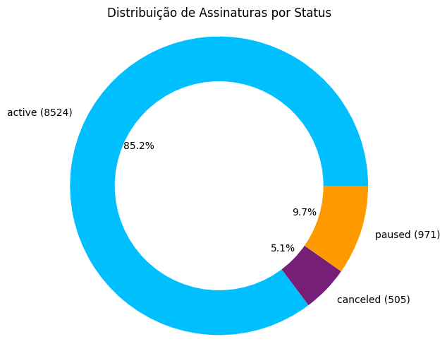

47% dos cancelamentos é em 2020, com setembro, novembro e dezembro tendo as maiores ocorrências de cancelamento desse ano.
2019 também se destaca, com 21%, mas também vale se atentar a 2021, que tem 11,7% dos casos de cancelamento apenas em janeiro e fevereiro.

gráfico que mostra distribuição por ano:

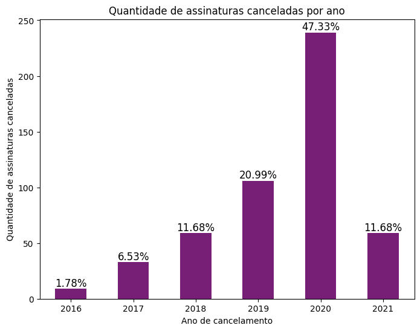

gráfico da distribuição por mês-ano:

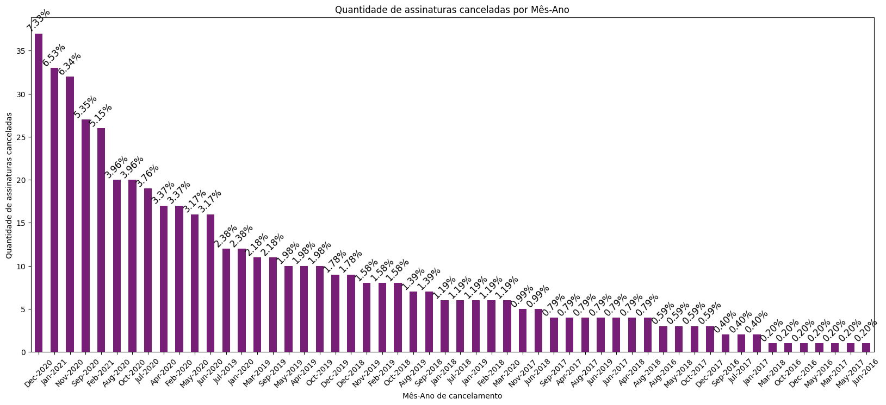

gráfico da distribuição por mês-ano em 2020:
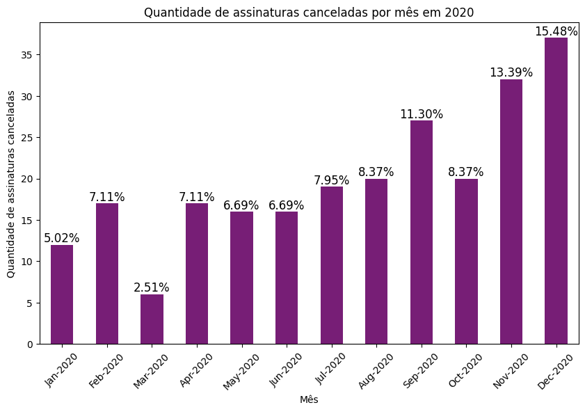

###Distribuição do churn geograficamente
Para começarmos a entender que grupo de assinantes tende a cancelar a assinatura, foi feita uma análise geográfica para saber a distribuição do Churn

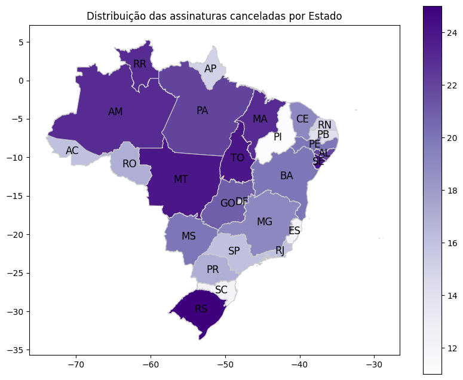

Percebe-se que a maior parte dos cancelamentos estão agrupados na região norte ou próximo a ela, o que pode ter relação com algum problema voltado à entrega, visto que a distribuição não é em uma região Central brasileira.

###Frequência do cancelamento

É interessante analisar a frequência do cancelamento a partir da data de criação da assinatura, pois com isso podemos responder perguntas como: "será que os usuários que cancelaram o plano já o usam a muito tempo ou são novos?".

Para isso, foi feito um gráfico que responde exatamente essa pergunta

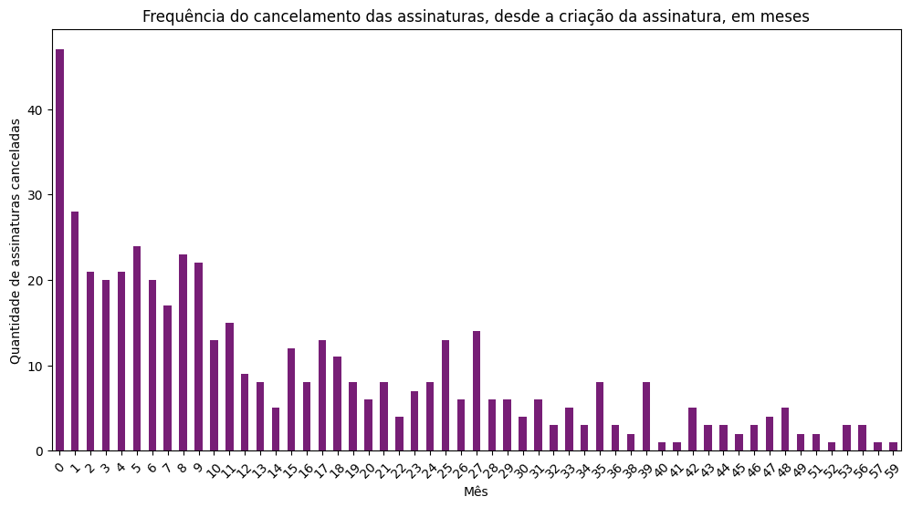

Observando o gráfico, observa-se nitidamente que as pessoas cancelaram a assinatura com maior frequência antes mesmo de completar um mês de uso. Ainda, maior parte desses cancelamentos foram feitos nos primeiros 6 meses de assinatura.

Ao notar isso, é importante saber também se as pessoas tendem a cancelar por um tempo muito longo após a última compra ou se existe a possibilidade de cancelamento antes mesmo de efetuarem a primeira compra.
Ao continuar essa análise, foi reparado que ninguém cancelou antes de fazer a primeira compra. Mas, foi descoberto que 24% das pessoas cancelam a assinatura antes de completar um mês da última compra. Assim como o outro gráfico, o cancelamento é feito nos primeiros 6 meses após a ultima compra.

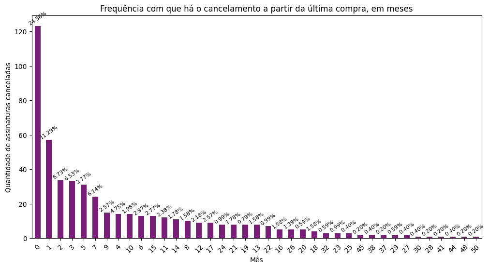

### Pedidos e receita

Também é proveitoso entender se a quantidade média de pedidos das assinaturas canceladas difere muito da média de pedidos do total de assinaturas do dataset amostral.
Ao criar um gráfico relacionando esses dados, que as pessoas que cancelaram a assinatura, em média fazem menos pedidos.

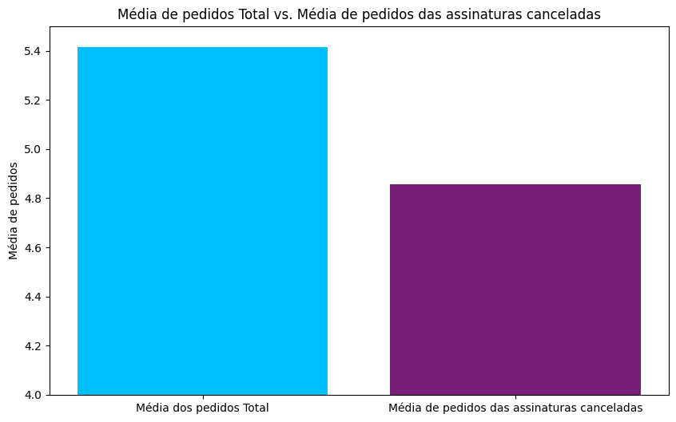

Seguindo essa lógica também é vantajoso fazer a análise em relação a receita.
Assim, com gráfico podemos entender que os cancelamentos tendem a ser de um grupo de pessoas com média de receita menor. Aproximadamente uma diferencia 112 de receita média.

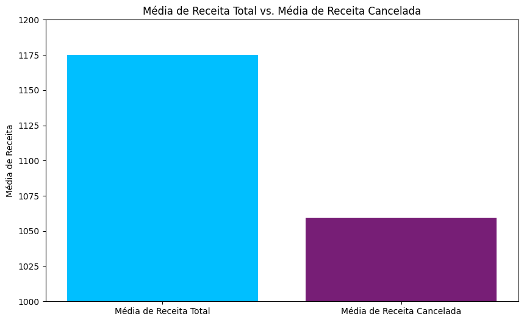

### Canal de marketing

Para buscar melhores meios de contornar o churn, é interessante entender a disttribuição das assinaturas cancelados por canal de marketing. Observando o gráfico de barras que traz essa relação entre valores e canal, se torna explicito ver que o organic_search tem maior quantidade de cancelamentos contados, seguido do direct.

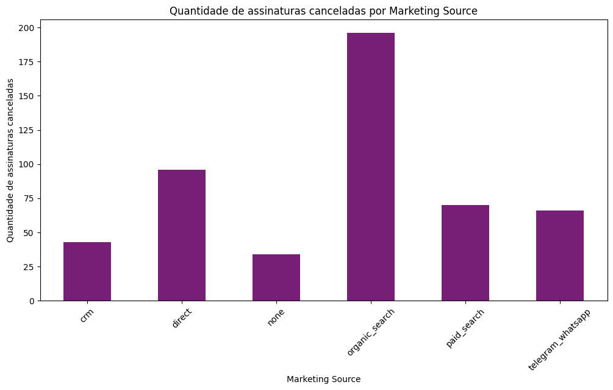

Então, vale analisar em relação ao tempo para entender se esses dados condizem com os períodos que tiveram maior taxa de cancelamento, pois isso pode ser consequência de uma estratégia de markeitng que não abarange o público que em um momento efetuou o cancelamento da assinatura.

Observando os dados de 2020, visto houve a maior quantidade de cancelamentos, e 2021, ano seguinte, condizente apenas a janeiro e fevereiro e com um numero de cancelamentos elevado, percebe-se que nos meses que houveram maior incidencia de cancelamentos, tinham mais assinantes do canal organic_search. Vale também observar que o mês com maior cancelamento (dez-2020) tinha mais assinantes do canal direct.

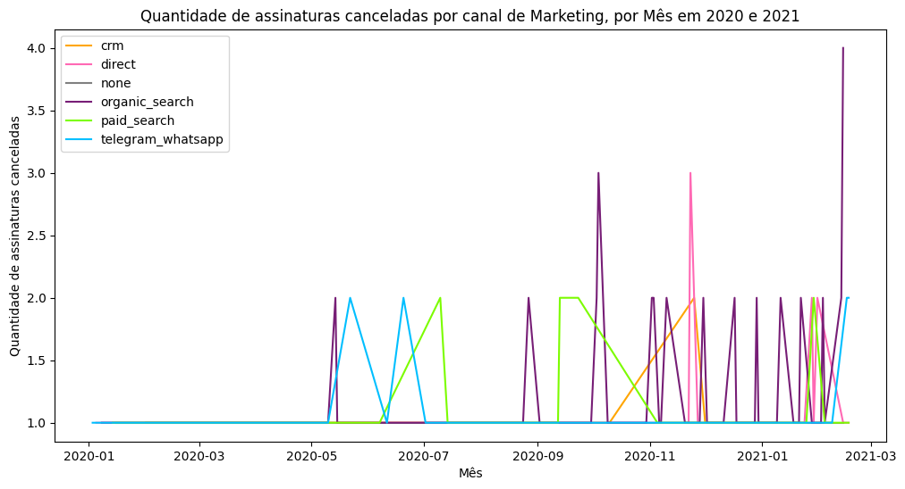

Tendo conhecimento sobre essa distribuição, foi analisado que grande parte das pessoas que cancelaram tinham em média entre 7 a 10 itens na assinatura. E, olhando para os churns por média de itens levando em consideração o canal organic_search, essa média também está entre 7 a 10 itens.

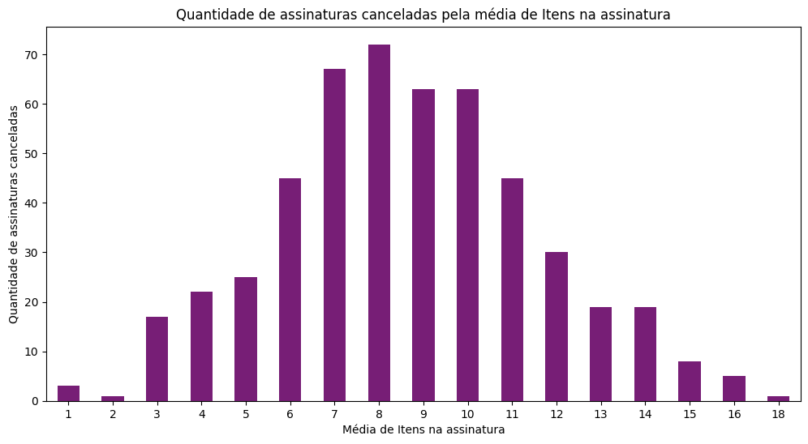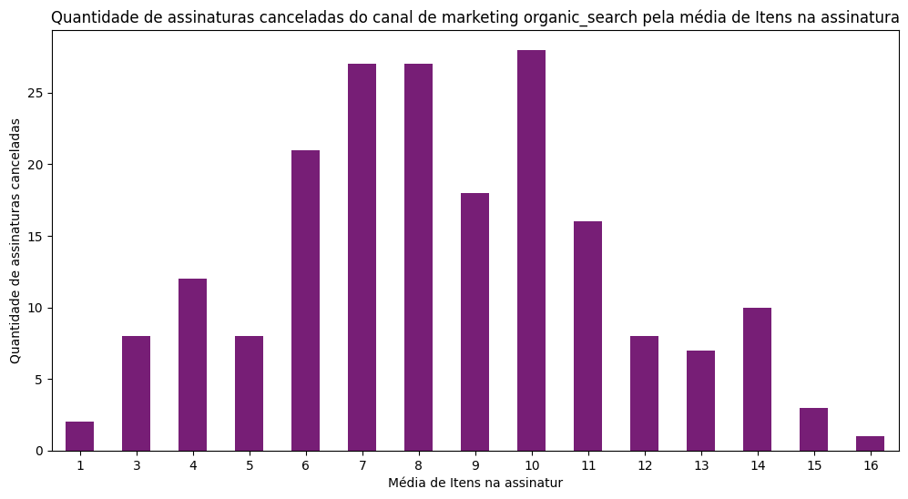

A mesma análise comparativa foi feita em relação a média de gastos por pedido e foi visto uma semelhança entre os dados gerais das assinaturas canceladas e os dados das assinaturas canceladas da organic_search. Os dois tem uma média de gastos maior entre 200 a 234, onde aproximadamente 40% dos dados nessa média são assinaturas da organic_search. 

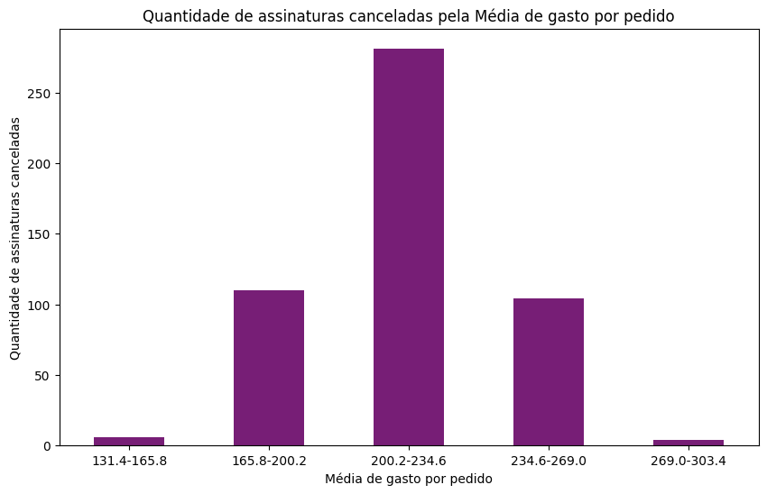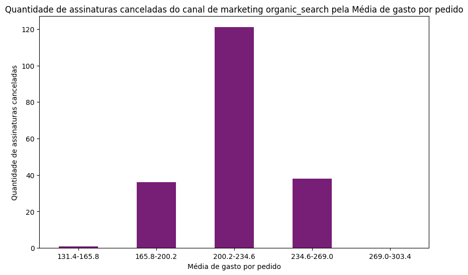

Olhando essas duas análises comparativas, prevalece a mesma questão: será que esse canal está seguindo as melhores estratégias para a manutenção desses assinantes com essa média de itens e esssa média de gastos?

## Próximos passos

Levando em consideração a análise feita, em suma das 505 pessoas, a maior quantidade de pessoas cancelou a assinatura do serviço no ano de 2020, tendo um aumento considerável em 2021. Eles estão, em sua maioria, distribuidas na região norte ou proximidades do país e cancelaram nos 6 primeiros meses a partir da de criação da assinatura, sendo que o maior indice de cancelamento foi antes de completar um mês. Esses assinantes também fizeram o cancelamento com maior frequência antes de completar um mês da ultima compra e tem maior indice de cancelamento nos primeiros 6 meses após a última compra. Tambem foi notado que a média de pedidos e de receita das assinaturas canceladas são menores que a média geral dos assinantes.

Além disso, também foi válido saber que o canal de marketing também influencia na distribuição dos cancelamentos. Foi visto que os canais organic search e direct têm dos dois maiores indice de cancelamento.
E ao fazer uma comparação da quantidade de itens e os gastos por pedido, dos cancelamentos e dos cancelamentos das assinaturas do organic search, vemos uma semelhança, o que pode deixar entendido que provavelmente a estratégia que esse canal está usando não está sendo favorável ao publico.

